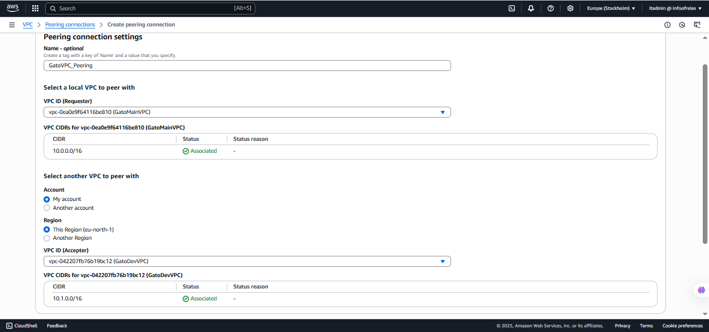

# Network Mastery with AWS VPC
Step-by-step process for the project "Network Mastery with AWS VPC", designed to help you or your team at GatoGrowFast.com build a secure and well-structured cloud network using AWS VPC.

### Project Title: Network Mastery with AWS VPC
#
## Phase 1: Introduction & Planning
### Goal:
Understand what a VPC is and how its components (subnets, gateways, route tables, etc.) work together to form a secure network.
#
## Phase 2: VPC Setup and Configuration
#
### Step 1: Create a Virtual Private Cloud (VPC)
> Create a virtual network environment that mimics a data center for GatoGrowFast.com.
* Go to AWS Console > VPC
* Click "Create VPC"
* Name it: `GatoMainVPC`
* IPv4 CIDR block: `10.0.0.0/16`
* Leave other settings as default
* Click Create VPC

#
### Step 2: Create Public and Private Subnets
> Divide your VPC into logical segments.
* Navigate to Subnets > Create Subnet
* Select VPC: `GatoMainVPC`
* Create at least 2 subnets in different Availability Zones:
  * Public Subnet A  – `10.0.1.0/24`
  * Private Subnet A – `10.0.2.0/24`
* Name and tag your subnets accordingly
* Enable Auto-assign public IP for public subnet only

#
### Step 3: Create and Attach an Internet Gateway (IGW)
> Allows instances in public subnet to access the internet.
* Go to Internet Gateways > Create
* Name it: `Gato-IGW`
* Attach it to `GatoMainVPC`

#
### Step 4: Configure Route Tables for Public Subnet
> Define routing rules to connect public subnet to the internet.
* Go to Route Tables
* Locate the main route table or create a new one (e.g., `Gato-Public-RT`)
* Edit routes:
  * Add route: `0.0.0.0/0` → Target: Internet Gateway
* Associate the route table with Public Subnet

#
### Step 5: Create NAT Gateway for Private Subnet
> Allows private subnet instances to access the internet for updates, etc., without being directly exposed.
* Go to Elastic IPs > Allocate Elastic IP
* Go to NAT Gateways > Create NAT Gateway
  * Subnet: Public Subnet
  * Elastic IP: select the one you just allocated
* Name it: `Gato-NATGW`

#
### Step 6: Configure Route Table for Private Subnet
> Use NAT Gateway to access the internet indirectly.
* Create or modify a route table (e.g., `Gato-Private-RT`)
* Add route: `0.0.0.0/0` → Target: NAT Gateway
* Associate the route table with Private Subnet

#
## Phase 3: VPC Peering for Inter-VPC Communication
### Step 7: Create Another VPC
> Simulate a second environment (e.g., Dev/Test).
* Name: `GatoDevVPC`
* CIDR: `10.1.0.0/16`

#
### Step 8: Create VPC Peering Connection
> Establish communication between VPCs.
* Go to Peering Connections > Create
  * Requester: `GatoMainVPC`
  * Accepter: `GatoDevVPC`
* After creation, click "Accept" on the Accepter side

#
### Step 9: Update Route Tables for Peering
> Allow subnets in both VPCs to communicate.
* In both VPC route tables (Main and Dev):
  * Add route to each other's CIDR blocks
    * In `GatoMainVPC`: `10.1.0.0/16` → Peering Connection
    * In `GatoDevVPC`: `10.0.0.0/16` → Peering Connection

#
## Phase 4: Secure Connectivity and Validation
### Step 10: Configure Network ACLs and Security Groups
> Ensure proper access control.
* Use Security Groups to allow/deny specific ports (e.g., allow SSH, HTTP)
* Set Network ACLs to control traffic at the subnet level
#
### Step 11: Launch EC2 Instances
> Test public and private connectivity
* Public Subnet: Launch an EC2 instance and verify internet access
* Private Subnet: Launch another instance and test:
  * Can it reach internet? (via NAT)
  * Can it reach public subnet?
  * Can it communicate with instance in `GatoDevVPC`?
#
## Project Wrap-up: Review & Documentation
#
### Step 12: Document Network Architecture
> Create a simple diagram or write-up showing:
* VPCs and CIDRs
* Subnet allocations
* IGW, NAT Gateway
* Route tables and their targets
* Peering setup
